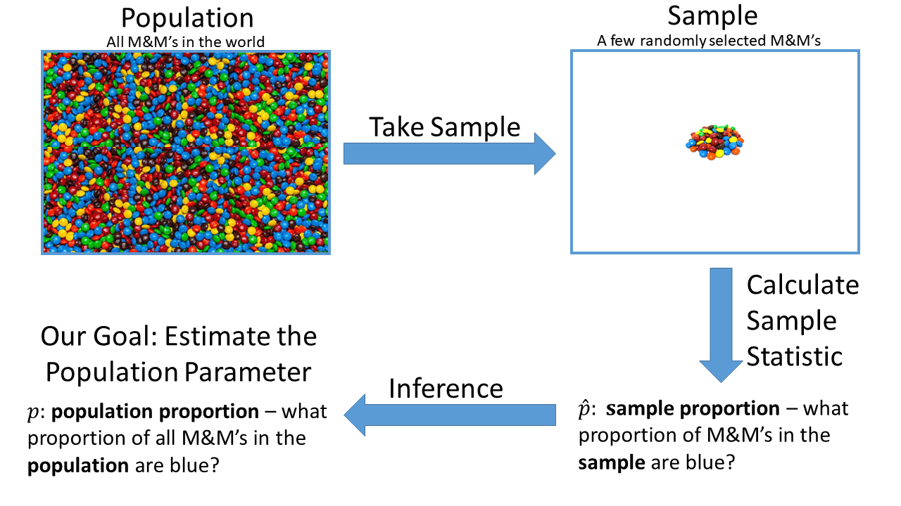

```{r setup, include=FALSE}
require(ggplot2)
require(grid)
require(dplyr)
require(tidyr)
```

\vspace{-0.5cm}

```{r, echo = FALSE}

```

 * Population Parameter ($p$): What proportion of the population are in a certain category of a categorical variable?
 * Sample Statistic ($X$): How many observational units in our sample are in that category?

\newpage

## Summary of Inference for Population Proportion

 * Sampling Distribution:
    * Distribution of values of sample statistic, across all possible samples of size $n$.
    * $X \sim \text{Binomial}(n, p)$
 * Hypothesis tests:
    * Calculations based on what the sampling distribution would be if the null hypothesis was true.
    * Example: $H_0$: p = 0.2 vs. $H_A$: p > 0.2.  Suppose $n = 40$ and $x = 14$.
    * p-value: Probability of getting a test statistic at least as extreme as what we observed in our sample, if $H_0$ is true.  A small p-value is evidence against $H_0$.
    * If $H_0$ is true, then $X \sim \text{Binomial}(40, 0.2)$

```{r, echo = FALSE, fig.height=1.8, fig.width=8}
x <- 14
n <- 40
p <- 0.2
Paul_success_probs <- data.frame(
  num_successes = seq(from = 0, to = n),
  pv = factor(c(rep(0, x), rep(1, n - x + 1))),
  probability = dbinom(x = seq(from = 0, to = n), size = n, prob = p))

ggplot() +
  geom_col(mapping = aes(x = num_successes, y = probability, fill = pv),
    data = Paul_success_probs) +
  geom_vline(xintercept = x) +
  xlab("Number of Successes") +
  scale_fill_manual("Included\nin p-value\ncalculation?", labels = c("No", "Yes"), values = c("black", "red")) +
  theme_gray(base_size = 14)
```

 * Confidence Intervals:
    * Also based on the Binomial sampling distribution, but we did not explore the details.
    * If we take a lot of samples and calculate a different confidence interval based on each sample, about 95% of those confidence intervals will contain the true value of the population proportion.

```{r, echo = FALSE, message = FALSE, warning=FALSE, fig.height = 1.8, fig.width = 8}
library(ggplot2)
library(dplyr)

#num_students <- 16
num_students <- 12

ci_results <- data.frame(
  student_num = factor(seq_len(num_students)),
  ci_lb = c(0.1103, 0.143, 0.244, 0.143, 0.245, 0.169, 0.209, 0.207, 0.157, 0.1602, 0.276, 0.266),
  ci_ub = c(0.2695, 0.314, 0.406, 0.314, 0.392, 0.347, 0.359, 0.339, 0.295, 0.3357, 0.472, 0.462),
  sample_size = "large"
)

ci_results <- ci_results %>% mutate(
    ci_center = (ci_lb + ci_ub) / 2
)

ggplot(data = ci_results,
  mapping = aes(xmin = ci_lb, xmax = ci_ub, x = ci_center, y = student_num)) +
  geom_errorbarh() +
  xlim(c(0, 1)) +
  xlab("p") +
  ylab("Student\nNumber") +
  theme_gray(base_size = 14)
```

## The Course So Far: Describe Observations in a Sample, Inference for a Proportion

\begin{table}[!h]
\begin{tabular}{p{3.15cm} p{2.25cm} p{5cm} p{3cm} p{3cm} p{5cm}}
\toprule
Variable & Plot & Numeric & Population & Sample & Sampling \\
Type(s) &   & Summary & Parameter & Statistic & Distribution \\
\midrule
1 Categorical & Bar & (Marginal) distribution & $p$ (proportion in a category) & $X$ (count in a category) & $X \sim \text{Binomial}(n, p)$ \\
\midrule
2 Categorical & Bar & Joint Distribution, Conditional Distribution & & & \\
\midrule
1 Quantitative & Histogram or Density & mean, median, quantiles, standard deviation, variance, IQR  & \multicolumn{3}{c}{ } \\
\midrule
1 Categorical, 1 Quantitative & Density or Box & summary statistics of the quantitative variable for each level of the categorical variable & & & \\
\midrule
2 Quantitative & Scatter & correlation & & & \\
\bottomrule
\end{tabular}
\end{table}

\newpage

## Next Up: Inference for the Mean of a Quantitative Variable

```{r, echo = FALSE}

```

 * Population Parameter ($\mu$): What is the average value of a quantitative variable, across the whole population?
 * Sample Statistic ($\bar{x}$ or $\hat{\mu}$): What is the average value of a quantitative variable, across the sample?

#### First Step: What is the sampling distribution of the sample mean?


